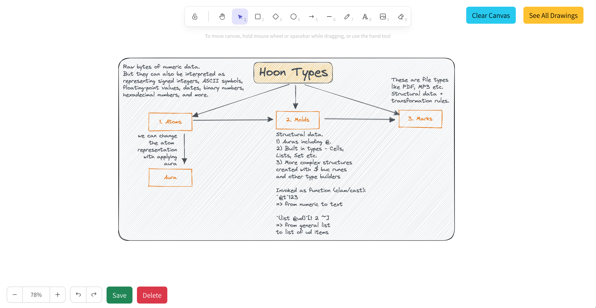
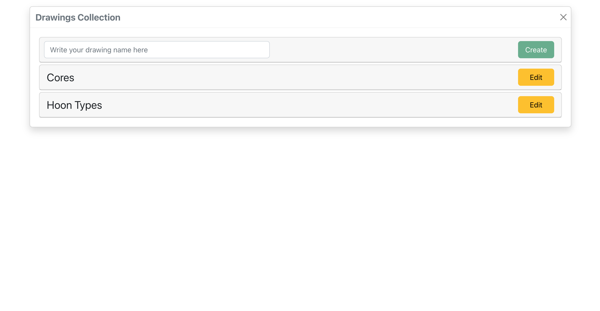

# Excalidraw for Urbit

Use [Excalidraw](https://github.com/excalidraw/excalidraw) sketching tool and Urbit as a backend. Currently the Urbit backend implementation fully reuse [%journal agent and the related structures](https://github.com/urbit/docs-examples/tree/main/journal-app)

# Features

At this stage we can use Excalidraw as normal on the main screen:

... and see a catalog with the exsiting drawings so we can select for update, delete or create a new one:

